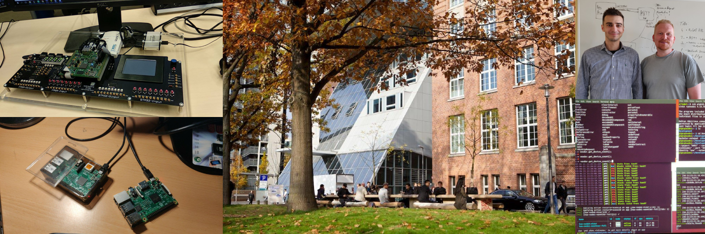

+++
title = "Education"
+++

## University

In 2019, I graduated from the [University of Applied Science Hamburg](https://www.haw-hamburg.de/en/) with a degree in computer science. I was lucky enough to join Prof. Becke's group of students who specialized in distributed systems. Under Professor Becke guidance, I completed my graduate thesis on "Analysis of a blockchain-based IoT infrastructure with Ethereum and Swarm".



During the study, the IoT devices were configured as blockchain nodes and integrated into a common private Ethereum network. In the respective architectures, a Swarm Peer-to-Peer network was used as the data storage and Smart Contract was provided to enable interaction with the blockchain. The system was exposed to a linearly increasing data load within 36 hours.

The final thesis can be found [here](https://reposit.haw-hamburg.de/handle/20.500.12738/9127).

## Certificates & Courses

- **React Native - The Practical Guide**
 
_Udemy, 2022_ 
ID: [UC-3d1f5088-e87b-4102-8e59-b39df95a5a84](https://www.udemy.com/certificate/UC-3d1f5088-e87b-4102-8e59-b39df95a5a84/)

- **ISTQB Certified Tester Foundation Level**
 _iSQI Group, 2017_ ID: [17-CTFL-118242-01](https://isqi.org/zertifikat-herunterladen.html?token=RewX25oPv49L3U41&download=1?token=RewX25oPv49L3U41&download=1)