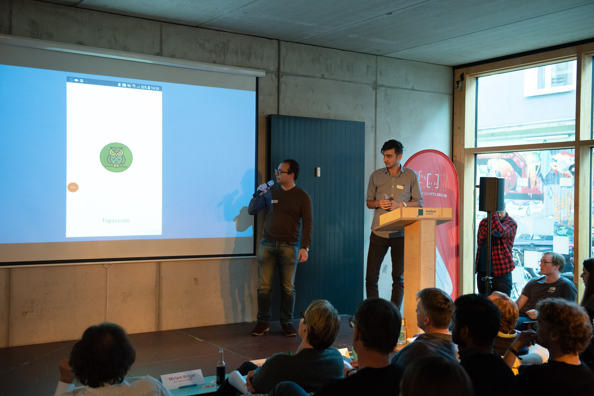
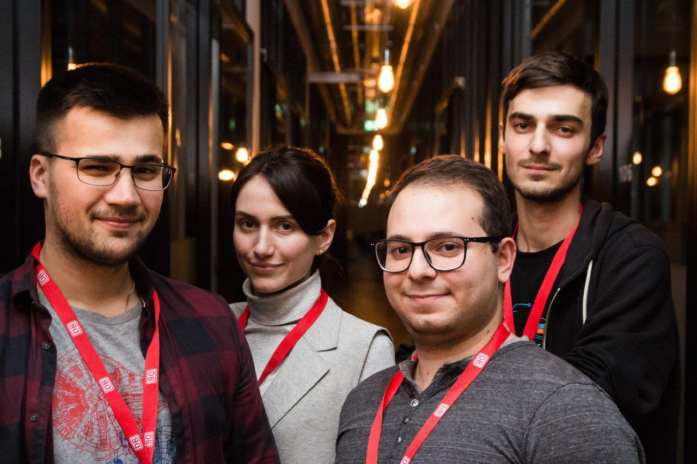

+++
title = "Other"
description = "Various projects that helped me learn something new."
+++

## Mobility Hackathon 2018

One of the last hackathons so far. There we came in as an experienced team and gave away one of the best projects. We have created an app for planning day trips around Hamburg using public transportation. Unfortunately the repository is private, but you can see the presentation below.  

[presentation](files/tripassisto.pdf)

## Design the Smart Mobility – ITS Hackathon Hamburg

This hackathon was organized by Deutsche Bahn (the national railway company of Germany). At that time, the messenger Telegram was rapidly gaining an audience and around the same time introduced a convenient api for chat bots. For ITS hackathon, we decided to implement a companion bot. First of all, routing was implemented through integration with db-api. After that, we implemented various additional functionality, such as notification service about breaks or incidents on the train through the same bot, and a couple of entertainment functions.

[GitHub](https://github.com/artyapple/dbhero)

## Mobility Hackathon 2017

My first hackathon, was organized by Hamburg public transport company (HVV). Our team tried to make a prototype for underground navigating without the Internet connection. We used bluetooth beacons for spatial orientation and implemented an simple app for interaction with the user.

[GitHub](https://github.com/artyapple/Indoor_navigation)


