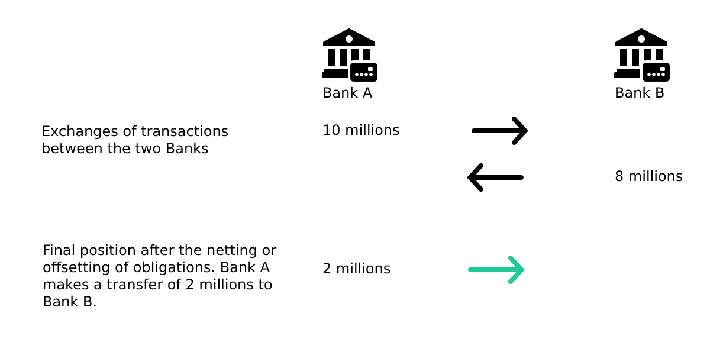
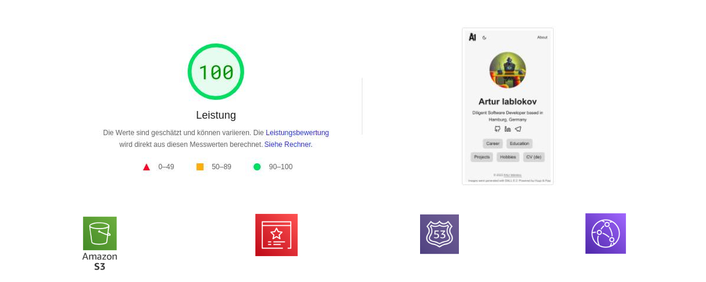
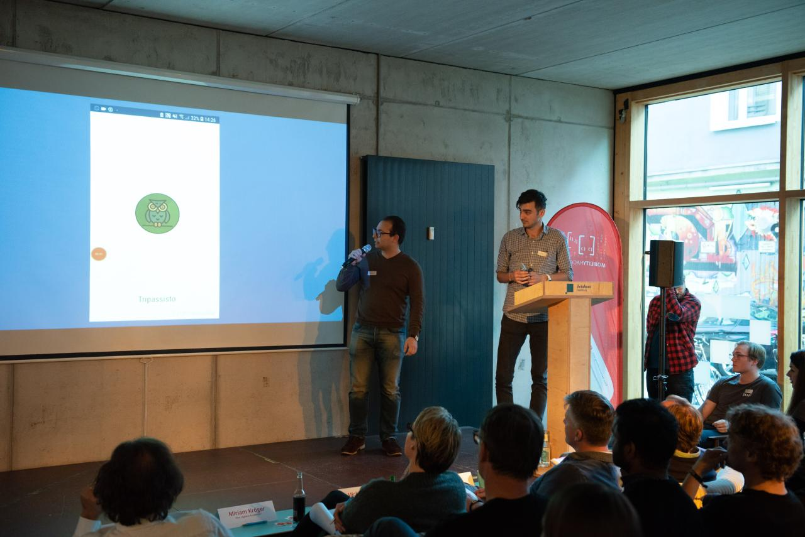
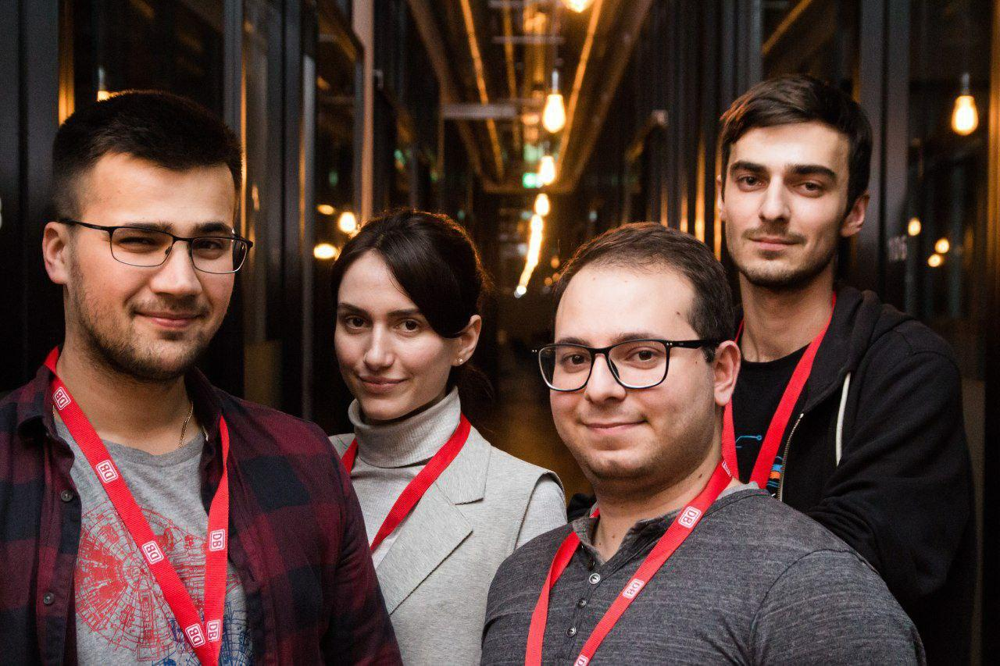

+++
title = "Projects"
weight = 4
+++
Work and pet projects & hackathons i have participated in.

## Integration of Continuous Gross Settlement

**Context:**
- Mission-critical service within Clearing and Settlement
- Built on legacy infrastructure
- Requires high fault tolerance and low latency

**Work done:**
- Designed and implemented a new service architecture
- Developed a REST client (Java, Resteasy)
- Integrated business logic with existing systems (Java / Oracle DB)
- Built a stub server for testing (Node.js, Swagger)
- Set up DevOps pipeline and containerization (Docker)

**Result:** In successful production operation since July 2022

## Personal website - iablokov.dev

**Context / goals:**
- Create a stylish, responsive, and fast personal website
- Serve as a showcase for presentations
- Cloud-only deployment (AWS) with a maximally cost-efficient setup

**Work done:**
- Built a static website (Hugo)
- Resolved .dev domain transfer (Google → Amazon, AWS Route53)
- Configured HTTPS with AWS Certificate Manager (ACM) + CloudFront
- Deployed hosting on S3 with a minimal-cost architecture
- Automated build & deployment pipeline using GitHub Actions

**Result:** Live and running since October 2022

## Mobility Hackathon 2018

My most recent hackathon. I participated with the team of professional and experienced developers to present an app for planning guided tours in Hamburg using public transportation. Unfortunately, the repository is private but you can check project presentation and video below. 

[presentation](files/tripassisto.pdf)

## Design the Smart Mobility – ITS Hackathon Hamburg

The following hackathon was organized by Deutsche Bahn (the national railway company of Germany). During this time, Telegram messenger was rapidly growing and introduced a convenient API for chat bots. As a result we decided to develop a companion bot for DB customers. Routing was implemented by integration with DB-API. Afterwards, we implemented additional functionality such as break and incident notifications on DB trains, and a couple of entertainment features.

[GitHub](https://github.com/artyapple/dbhero)

## Mobility Hackathon 2017

The first hackathon i participated in was organized by Hamburg public transport company (HVV). Our team tried to make a prototype for underground navigating without Internet connection. We used Bluetooth beacons for spatial orientation and presented an easy to use app for interaction with the users.

[GitHub](https://github.com/artyapple/Indoor_navigation)
